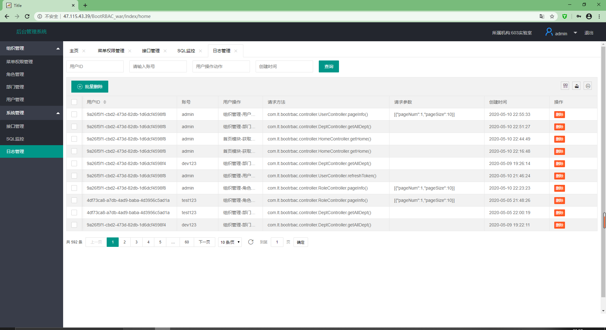
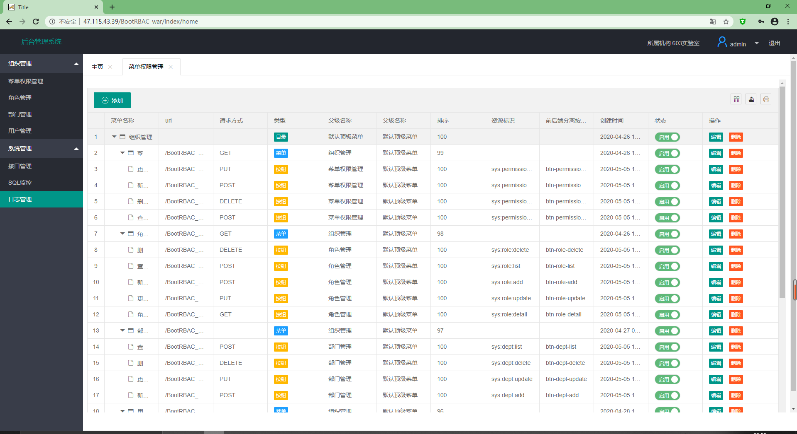
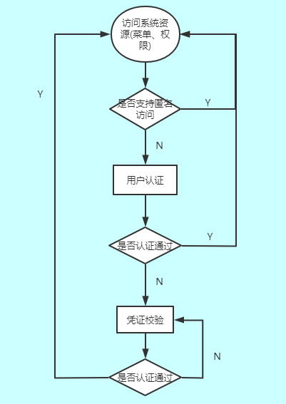
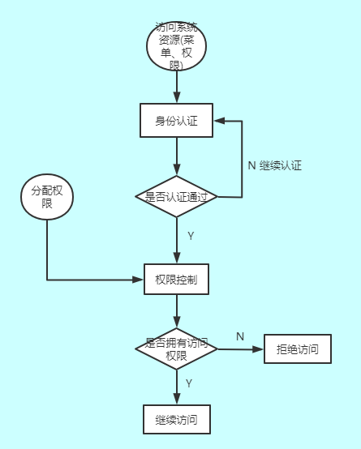
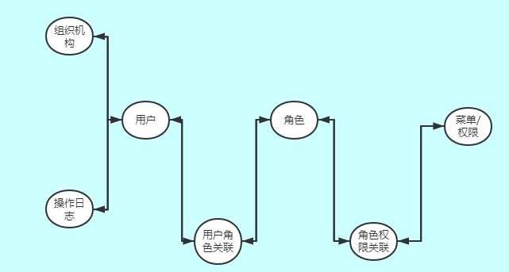

# BootRBAC

> 基于springboot、shiro、jwt的后台管理系统，权限控制的方式为RBAC。


### 技术点

1. 后端框架:springboot、Mybatis、Druid、shiro、jjwt
2. 数据存储\缓存:Mysql、Redis
3. 模板引擎:thymeleaf、layui
4. 项目依赖管理:Maven
5. 接口:swagger2


### 部署

> [线上演示地址](http://47.115.43.39/BootRBAC_war/index/login)   请勿删除数据
>
> username: admin或dev123
>
>  password: 123456或666666

#### 步骤

1. 本地或远程开启一个redis服务，修改配置文件中redis信息
2. mysql导入提供的sql文件，修改配置文件中数据库文件
3. 安装tomcat，把war包放入webapps目录
4. 安装nginx代理tomcat
5. 访问``主机名+项目名+/index/login``


#### 遇到的坑

- springboot项目打war包的方式 [spring boot 项目部署到服务器 两种方式](https://blog.csdn.net/qq_22638399/article/details/81506448)

- 由于在thymeleaf中使用的是相对路径，在部署的时候请求全是404，如下解决:

  1. thymeleaf中引用css、js、图片等

     ```html
     <!--其中的@{}里边必须要以“/”开头，才能正确根据项目路径找到相应的静态资源。-->
     <link rel="stylesheet" type="text/css" href="statics/css/index.css" th:href="@{/statics/css/index.css}" media="all" />
     ```

  2. script代码里获取项目根路径的方式

     ```js
     <script th:inline="javascript" type="text/javascript">
         var ctxPath  = [[@{/}]];
         var ctxPath = /*[[@{/}]]*/'';
         var ctxPath=[[${#httpServletRequest.getContextPath()}]];
     </script>
     ```

  3. 单独的js文件获取项目根路径的方式

     ```js
     function getRootPath() {
         //获取当前网址，如： http://localhost:9527/zdss-web/login/login.do
         var curWwwPath = window.document.location.href;
         //   console.log("当前网址：" + curWwwPath);
     
         //获取主机地址之后的目录，如：zdss-web/login/login.do
         var pathName = window.document.location.pathname;
         //  console.log("当前路径：" + pathName);
     
         var pos = curWwwPath.indexOf(pathName);
         //   console.log("路径位置：" + pos);
         
         //获取主机地址，如： http://localhost:9527
         var localhostPath = curWwwPath.substring(0, pos);
         console.log("当前主机地址：" + localhostPath);
         
         //获取带"/"的项目名，如：/zdss-web
         var projectName = pathName.substring(0, pathName.substr(1).indexOf('/') + 1);
         console.log("当前项目名称：" + projectName);
     
         return localhostPath+projectName;
     }
     ```

  4. 通过ServletResponse对象直接响应结果注意编码问题

     ```java
     private void customResponse(int code,String msg,ServletResponse response){
         //自定义异常的类，用户返回给客户端相应的json格式的信息
         try{
             DataResult result=DataResult.getResult(code,msg);
             response.setContentType(MediaType.APPLICATION_JSON_UTF8.toString());
             response.setCharacterEncoding("UTF-8");
             String json= JSON.toJSONString(result);
             OutputStream outputStream = response.getOutputStream();
             outputStream.write(json.getBytes("UTF-8"));
             outputStream.flush();
         }catch (IOException e){
             log.error("customResponse 响应错误",e);
         }
     }
     ```


#### 项目截图






### 系统分析

> 此项目以前后端分离的方式实现一个基于**资源**的后台权限管理系统，权限管理包括**用户认证**和**用户授权**两部分

#### 用户认证

+ 用户访问系统，系统要验证用户身份的合法性。常用的验证的方式:用户名密码方式、token校验

+ 用户认证流程图

  


#### 用户授权

+ 用户通过认证后，系统对用户访问资源进行控制，用户具有该资源的访问权限方可访问

+ 用户授权流程图

  


#### 表结构设计

+ 一共有7张表，源文件中提供了sql

+ ER图

  


### 环境搭建

#### 数据库相关

1. Mybatis框架和Druid数据源的配置(详见application.properties)

2. 使用Mybatis的逆向工程生成实体类(配置文件generatorConfig.xml)

> 这里使用逆向工程有一个bug，mapper文件里会生成重复代码，没找到原因

3. 访问http://localhost:8080/druid/login.html可进入druid提供的SQL监控


#### 集成swagger2

> 使用swagger可以让接口文档在线自动生成、还可以直接进行接口功能测试

1. 在配置文件中开启swagger的开关

2. 创建``SwaggerConfig``配置类将swagger注入Spring，并添加一些配置

3. 访问http://localhost:8080/swagger-ui.html可进入接口文档


#### 集成Reids

1. 本地或远程开启一个redis服务
2. 配置redis连接池(详见application.properties)
3. redis默认序列化时会使用JDK序列化器，使得redis中的可以和value不可读，这里需要自定义序列化器 [自定义redis序列化方式](https://blog.csdn.net/weixin_41657493/article/details/92851382)
4. 创建RedisConfig配置类指定``redisTemplate``序列化方式为自定义
5. 创建redis的工具类``RedisService``,对``redisTemplate``进行了封装


#### 统一响应封装

> 现在前后端分离很普遍，前后端的交互一般使用json的形式，这里也封装一个统一的返回格式

1. 创建一个``DataResult``的泛型类作为统一返回格式，有三个属性``code``、``msg``、``data``
2. 封装一个统一响应code的枚举类``BaseResponseCode``
3. 封装``DataResult``实现对code枚举类的接收


#### 全局异常统一处理

> 系统中一般是编译异常和运行时异常，运行时异常包括我们自定义的一些业务异常，需要一层层的向上抛，在controller层通过try...catch来处理，但是使用try..catch很难看也很难维护，Spring为我们提供了三种统一异常处理的方式:
>
> a、在controller中使用@ExceptionHandler注解
>
> b、自定义Resolver实现HandlerExceptionResolver接口
>
> c、使用@ControllerAdvice+@ExceptionHandler注解    (使用这一种)

1. 创建一个``RestExceptionHandler``类加上注解
2. 在类中声明异常捕获的方法


#### 使用Hibernate Validator进行数据校验

> 主要用于接口api的入参校验和封装工具类在代码中校验

+ 常用的注解
  + ``@NotEmpty``用在集合类上面
  + ``@NotBlank``用在String上面
  + ``@NotNull``用在基本数据类型上
  + ``@Vlaid``启用校验
+ 在``RestExceptionHandler``中添加校验异常


#### 集成JWT(Json Web Token)

> JWT全称JSON  Web Tokens，是一种规范化token。是对token技术提出的一套规范。
>
> jwt的学习可以参考[JSON Web Token 入门教程](http://www.ruanyifeng.com/blog/2018/07/json_web_token-tutorial.html)

1. pom文件引入相关依赖
2. ``application.properties``中配置相关属性和密钥
3. 创建配置读取类，解决静态工具类无法读取配置文件的问题
4. 创建``JwtTokenUtil``类，封装jwt常用的方法


#### 集成shiro框架

> shiro是一个轻量级的权限管理框架，用于实现用户认证(Authenticator)、用户授权(Authorizer)。
>
> shiro的学习可参考 
>
> [跟我学shiro](https://www.iteye.com/blog/jinnianshilongnian-2018398)
>
> [Shiro + JWT + Spring Boot Restful 简易教程](https://juejin.im/post/59f1b2766fb9a0450e755993#heading-0)

+ 步骤:
	1. 由于使用JWT作为用户凭证，需要自定义token类继承``UsernamePasswordToken``重写方法
	2. 自定义token过滤器继承``AccessControlFilter``,这个类主要是拦截用户认证的请求，首先校验客户端是否携带了token，如果没有，直接通过response返回，然后主体提交给自定义realm进行认证和授权
	3. 自定义域继承``AuthorizingRealm``重写``doGetAuthorizationInfo``和``doGetAuthenticationInfo``,前者是当需要检测用户权限时调取，后者是用户认证时调取
	4. 自己实现 CredentialsMatcher 的一个类来实现定制化的账户密码验证机制
	5. 配置类中配置``Realm``、``securityManager``、``shiroFilterFactoryBean``以及配置shiro支持aop

+ 认证流程源码

  ```txt
  客户端访问
  ==> 所有被shiro拦截的请求进入CustomAccessControlFilter
  ==> 主体提交给SecurityManager(AuthenticatingSecurityManager)
  ==> 有缓存就从缓存中获取认证信息,如果没有则执行自定义域中doGetAuthenticationInfo()方法 
  ==> 最后会提交给自定义的验证器进行验证(成功或失败)
  ```

+ 授权流程源码

  > 必须认证成功才能执行授权

  ````txt
  主体授权(subject.isPermitted())、subject.checkRole("xxx角色")、shiro前端标签授权、后端授权注解(@RequirePermissions("sys:klog:list"))
  ==> SecurityManager(AuthorizingSecurityManager)执行授权
  ==> 有缓存就从缓存中获取认证信息,如果没有则执行自定义域中doGetAuthorizationInfo()方法
  ==> 拿到后把用户拥有的权限信息存入缓存
  ==> 返回用户所拥有的权限信息
  ````

  

### 系统功能实现

#### 主页初始化

+ 获取首页数据接口
+ 从Token获取用户id
  + 获取用户信息和权限树信息封装成VO返回


#### 组织管理-菜单权限管理

+ 获取所有的菜单权限数据 

  + 权限标识:``sys:permission:list``

+ 菜单权限树-只递归查询到菜单接口  

  + 权限标识:``sys:permission:update || sys:permission:add``

+ 菜单权限树-递归查询所有接口

  + 权限标识:``sys:role:update || sys:role:add``

  > 这段递归权限层级的代码可以研究下

  ````java
  /**
  * 查询到菜单层级的权限
  * @return 单层级的权限树
  */
  @Override
  public List<PermissionRespNodeVO> selectAllMenuByTree() {
      List<SysPermission> list = sysPermissionMapper.selectAll();
      List<PermissionRespNodeVO> result = new ArrayList<>();
      //创建默认顶级菜单
      PermissionRespNodeVO respNodeVO = new PermissionRespNodeVO();
      respNodeVO.setId("0");
      respNodeVO.setTitle("默认顶级菜单");
      //添加子层级权限，递归遍历到菜单
      respNodeVO.setChildren(getTree(list, true));
      result.add(respNodeVO);
      return result;
  }
  
  /**
  * 查询所有层级权限
  * @return 所有层级权限树
  */
  @Override
  public List<PermissionRespNodeVO> selectAllTree() {
      //添加子层级权限，递归遍历到按钮
      return getTree(selectAll(), false);
  }
  
  /**
  * type=true  递归遍历到菜单
  * type=false 递归遍历到按钮
  */
  private List<PermissionRespNodeVO> getTree(List<SysPermission> all, boolean type) {
      List<PermissionRespNodeVO> list = new ArrayList<>();
      if (all.isEmpty()) {
          return list;
      }
      for (SysPermission sysPermission : all) {
          //从目录开始遍历
          if (sysPermission.getPid().equals("0")) {
              //新建一个权限节点
              PermissionRespNodeVO respNodeVO = new PermissionRespNodeVO();
              BeanUtils.copyProperties(sysPermission, respNodeVO);
              respNodeVO.setTitle(sysPermission.getName());
              if (type) {
                  //递归遍历到菜单
                  respNodeVO.setChildren(getChildExBtn(sysPermission.getId(), all));
              } else {
                  //递归遍历到按钮
                  respNodeVO.setChildren(getChild(sysPermission.getId(), all));
              }
              list.add(respNodeVO);
          }
      }
      return list;
  }
  
  
  /**
  * 只递归到菜单
  */
  private List<PermissionRespNodeVO> getChildExBtn(String id, List<SysPermission> all) {
      List<PermissionRespNodeVO> list = new ArrayList<>();
      for (SysPermission s : all) {
          //找出子级权限,排除按钮
          if (s.getPid().equals(id) && s.getType() != 3) {
              PermissionRespNodeVO respNodeVO = new PermissionRespNodeVO();
              BeanUtils.copyProperties(s, respNodeVO);
              respNodeVO.setTitle(s.getName());
              respNodeVO.setChildren(getChildExBtn(s.getId(), all));
              list.add(respNodeVO);
          }
      }
      return list;
  }
  
  /**
  * 递归遍历所有数据
  */
  private List<PermissionRespNodeVO> getChild(String id, List<SysPermission> all) {
      List<PermissionRespNodeVO> list = new ArrayList<>();
      for (SysPermission s : all) {
          if (s.getPid().equals(id)) {
              PermissionRespNodeVO respNodeVO = new PermissionRespNodeVO();
              BeanUtils.copyProperties(s, respNodeVO);
              respNodeVO.setTitle(s.getName());
              respNodeVO.setChildren(getChild(s.getId(), all));
              list.add(respNodeVO);
          }
      }
      return list;
  }
  ````

+ 新增菜单权限接口

  + 权限标识:``sys:permission:add``

  + 在调用mapper层插入之前要验证菜单是否合法

+ 编辑菜单权限接口

  + 权限标识:``sys:permission:add``

  + 接收到VO后要校验是否合法
  + 如果所属菜单发生了变化，需要判断是否有子集，如果有抛出异常
  + 如果授权标识符发生了变化要查询出拥有该权限的所有用户，在redis中设置刷新Token，并且删除用户缓存信息

+ 删除菜单权限接口

  + 权限标识:``sys:permission:delete``
  + 判断是否有子集关联，如果有抛出异常
  + 解除角色和菜单权限的关联
  + 逻辑删除权限数据
  + 如果删除的权限有关联的角色信息，在redis中设置刷新Token，并且删除用户缓存信息


#### 组织管理-用户管理

+ 用户登陆接口
  + 获得用户的AccessToken和refreshToken
+ 分页获取用户列表接口
  + 权限标识:``sys:user:list``
  + 使用pageHelper进行分页
+ 新增用户接口
  + 权限标识:``sys:user:add``
+ 查询用户拥有的角色数据接口
  + 权限标识:``sys:user:role:update``
  + 查询拥有角色集合和所有角色集合
+ 保存用户拥有的角色接口
  + 权限标识:``sys:user:role:update``
  + 维护用户角色关联表
  + 标记关联用户自动刷新、删除缓存
+ 刷新token接口
  + 校验刷新token是否有效
  + 校验刷新token是否被加入黑名单
+ 列表修改用户信息接口
  + 权限标识:``sys:user:update``
  + 如果用户被管理员锁定，redis中标记账户被锁定
+ 批量/单个删除用户接口
  + 权限标识:``sys:user:delete``
  + 逻辑删除用户
  + redis标记用户删除，过期时间为token剩余时间
  + 删除用户缓存
+ 用户退出登陆
  + 获取主体，主体退出
  + 把accessToken加入黑名单
  + 把refreshToken加入黑名单
+ 列表修改用户信息接口
  + 权限标识:``sys:user:update``
+ 修改个人密码接口
  + 校验旧密码，保存新密码
  + 把accessToken加入黑名单
  + 把refreshToken加入黑名单
  + 删除用户缓存信息


#### 组织管理-部门管理

+ 获取所有部门数据接口

  + 权限标识:``sys:dept:list``

+ 部门树形结构列表接口

  + 权限标识:``sys:user:update || sys:user:add || sys:dept:update || sys:dept:add   ``
  + 更新部门信息时需要去除这个部门的叶子节点
  + 递归获取部门树

+ 新增部门数据接口

  + 权限标识:``sys:dept:add``
  + 部门关系编码=redis记录的部门编码+父级关系编码

+ 更新部门数据接口

  + 权限标识:``sys:dept:put``

  + 此方法需要开启事务回滚

  + 首先保存更新部门数据

  + 维护层级关系，需要查出旧的父级部门层级关系编码、新的层架关系编码、旧的关系编码

  + sql如下

    ````xml
     <!-- 维护Relation_code的层级关系-->
        <update id="updateRelationCode">
            update sys_dept
            set relation_code=replace(relation_code,#{oldStr},#{newStr})
            where relation_code like concat(#{relationCode},"%")
        </update>
    ````

+ 删除部门接口

  + 权限标识:``sys:dept:delete``
  + 如果它和它自己的叶子节点有关联用户，抛出异常
  + 逻辑删除部门数据


#### 组织管理-角色管理

+ 分页获取角色数据接口

  + 权限标识:``sys:role:list``
  + 使用PageHelper进行分页

+ 新增角色数据接口

  + 权限标识:``sys:role:add``
  + 开启事务回滚
  + 保存角色信息
  + 如果角色包含权限，则调用``RolePermissionServiceImpl``维护角色和权限信息

+ 获取角色详情接口

  + 权限标识:``sys:role:detail``
  + 获取基本信息和用户所拥有的菜单权限

+ 更新角色信息接口

  + 权限标识:``sys:role:update``
  + 开启事务回滚
  + 保存角色基本信息
  + 维护角色和菜单权限关联信息
  + 标记关联用户自动刷新、删除缓存

+ 删除角色信息接口

  + 权限标识:``sys:role:delete``
  + 逻辑删除角色信息
  + 删除角色和菜单关联数据
  + 删除角色和用户关联数据
  + 标记关联用户自动刷新、删除缓存
  
  

#### 系统管理-日志管理

> 自定义注解，配置AOP实现用户操作日志功能

+ 分页查找操作日志接口

  + 权限标识:``sys:log:list``
  + 使用PageHelper进行分页

+ 删除日志接口

  + 权限标识:``sys:log:delete``
  + 批量/单个删除合并，sql使用``<foreach>``进行遍历id，批量操作
  
  

#### 系统管理-SQL监控

+ 前端跳转到/druid/sql.html


#### 系统管理-接口管理

+ 前端跳转到/swager-ui.html


